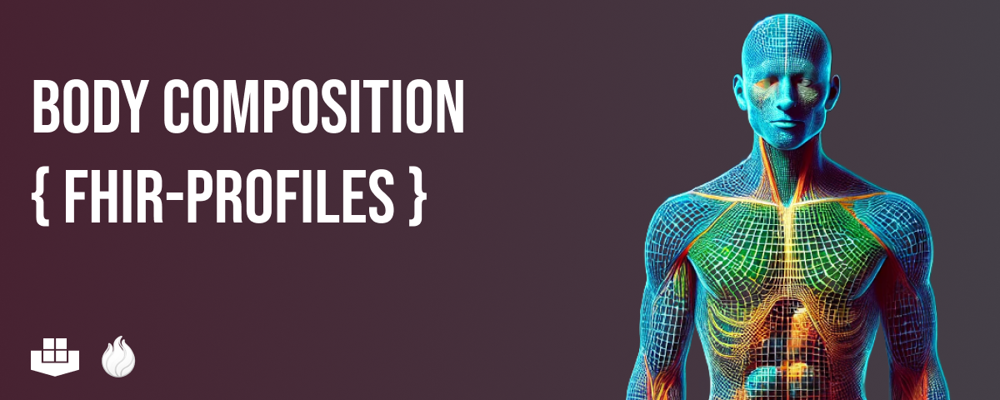

# BOA-Profiles

## Introduction

In healthcare, the **Fast Healthcare Interoperability Resources ([FHIR](https://hl7.org/fhir/))** standard is widely used to store and exchange healthcare data efficiently. At the same time, AI models that analyze images from CT and MRI scans are becoming increasingly important for measuring body structures and organs. However, integrating these AI-generated measurements into an interoperable format remains a challenge, which is crucial for advancing personalized medicine. Especially, since AI applications will not only be seen as data `consumers` in the future but also as data `producers`.

This project addresses this gap by incorporating image-based measurements and biomarkers into FHIR profiles. By doing so, it standardizes the collection, storage, and exchange of imaging-based information, allowing different healthcare systems to share data seamlessly. This will lead to more timely and personalized treatment decisions, ultimately improving patient care.

## Objective

The goal of this project is to integrate body organ and composition measurements derived from routine CT scans into FHIR profiles, laying the groundwork for standardized storage of image-based biomarkers.

## Methods

We utilized a **Body and Organ Analysis ([BOA](https://github.com/UMEssen/Body-and-Organ-Analysis))** model to extract relevant data from CT scans and integrated this information into FHIR profiles. This allows for the interoperable use of AI-generated biomarkers in radiology and facilitates opportunistic screening by capturing incidental findings during routine imaging.

## Results

Four specific FHIR profiles were developed/extended:

1. **Body Composition Analysis Observation**
2. **Body Structure Volume Observation**
3. **Diagnostic Report**
4. **Imaging Study**

These profiles allow the use of AI segmentation models for Body Composition Analysis and establish a direct link between imaging studies and measurements.

## Bigger Picture

The BOA profiles represent an initial step towards standardizing the use of CT-based measurements in FHIR. By enhancing the interoperability of imaging-derived data, these profiles support the development of personalized medicine and can be adapted for use with other imaging modalities and algorithms.